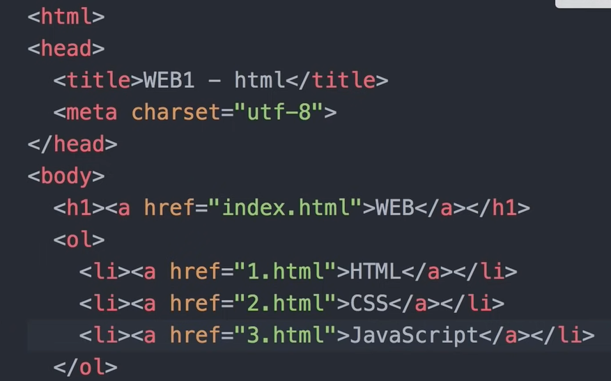

1.html

 웹페이지를 연다 -> 항상 주소를 입력한다

내 컴퓨터가 주소에 해당하는 것을 입력한다 에서 -> 


파일 열기 -> 엣지는 안됨 -> ctrl + 한/영 + o -> 웹페이지 실행 가능 바로 그냥 실행해도 됨


내가 주인공이다. -> 나의 내용을 채우자


웹을 지배하는 강력한 문법 : 태그...


```<strong>  강조표시  </strong> ```


```<u> 밑줄 </u> : 밑줄을 그어줌```

 ```<h1> W3C </h1>``` : 제목 h1부터 h6 까지 볼 수있음

-> 줄바꿈은 자동으로 됨


현재 150개의 태그 이상이 있음

한 페이지에서 평균적으로 15개 ~ 35개로 이루어져 있다.

```<hr> hr </hr>``` :  밑줄을 그어줌

```<br> :  줄을 바꿔줌 여기서도 줄바뀌기 때문에 이렇게 됨```

```<p> </p> ```: 단락을 나눠줌 , 시각적으로 자유도가 br보다 떨어짐 하지만 css로 커버 가능


모르는 것을 알고있다면 해결이 가능하다.

기본이 가장 중요하다...


속성 - html의 심화 부분


이미지를 넣는 경우

``````

이미지의 크기를 조정하는 경우

``` width = 100 or 200 등등 ..``` 

src, width 등은 속성이며, 선언 위치는 상관이 없도록 되어있다.


부모 자식과 태그

<parent>

​	<child> </child>

</parent>


목차를 쓸 때 사용하는 태그가 존재한다.

list -> li 라고 표시

<li> HTML </li>

<li> CSS </li>

<li> javaScript </li>

전부 리스트(li) 태그를 사용한다면 서로가 구분하기 어려워진다.

따라서 li의 상위 태그(부모 태그)인 <ul> </ul> 을 사용한다. 

부모 태그를 사용하는 경우 child 태그는 들여쓰기를 통해 코드를 보기 쉽게 한다.


특히 li와 ul은 반드시 서로 이어지는 관계이니 두가지를 써야한다.

만약에 앞 부분에 숫자태그를 붙여야 한다면, li에 각 숫자를 넣어줘도 되지만, 

 

<ol>
    <li>123</li>
    <li>123</li>
    <li>123</li>
</ol>

아래 처럼 자동으로 가능하다. 궁금하면 눌러보시길 (ul 대신 ol 태그를 사용함)

ol : Ordered List

ul : unordered List


표를 작성할 때는

<table>
    <tr>
        <td>head</td>
        <tr>
            <td> test </td> # 이중으로 작성하니 안되는구만.
    	</tr>
        <td>head</td>
        <td>head</td>
    </tr>
    <tr>
        <td>123</td>
        <td>123</td>
        <td>123</td>
    </tr>
</table>

코드는 클릭으로 열어보시죠.

순서로 되어 있음 ( <table> - <tr> - <td> )


문법은 여기까지.

이제 많은 데이터들이 모인다고 가정할 때

정리를 어떤식으로 하면 잘 할 수 있을까가 중요해짐 ( 가장 중요한 애들을 살펴볼 예정 )


step1 . 제목 정하기 : <title> 제목 </title>

검색엔진은 타이틀로써 검색을 할 수있는 부분이 존재한다.

step2. 인코딩 맞추기

작성한 코드와 웹페이지의 인코딩이 불일치하는 경우가 다수 존재하므로

<meta charset='utf-8'>

</meta>

이렇게 한다면 한글도 깨지지 않습니다. (보통 없다면 영어를 기준으로 깨지지 않음 한글은 깨짐)


step3. 제목을 나눴으므로, 제목부분과 인코딩 부분은 head 내용은 body를 이용하여 묶어주기

 

이렇게 묶어주기 


step4. head와 body를 묶어서 <html>를 달아주기

또한 이어서 최상단에 <!doctype html> : 해당 문서가 html로 작성되었다는 것을 뜻함

이라고 써줘야 함


링크의 태그 명은 <a> 이다.

```<a href = 'https:// ... ...'> 링크 제목 등 원하는 글  </a>```

링크 태그를 걸었다면, 이동되는 링크에 대해서 연결을 통해 가능하게 합니다.

Web Page를 엮어서 Web site를 만들 예정

 

각각에 대해서 링크를 걸어도 되고 따로 만든 html 파일을 넣어도 됩니다.

 

동영상 삽입 방법

예시 ) 유튜브

소스 -> embed 클릭

"<iframe
	width = '560' height = '315'
	src = 'www.youtube.com/xxx'
    frameborder = 0 allowfullscreen>
</iframe> 이렇게 사용함.


댓글 삽입 :

LiveRe or disqus를 사용하여 추가함

보통 추가할 때는 <p>마크를 달아서 단락구분을 해주고,

제공하는 코드로써 구현을 하게됨

제공하는 것을 사용하지 않으려면, 백앤드쪽 기술을 배워야 함


채팅(상담) 기능 추가

tawk 사이트를 사용하면 댐

로그인 -> 관리자 (설정) -> 위젯 코드 복사

복사된 코드를 웹사이트에 추가함


웹사이트 분석기

구글 애널리틱스를 통해서 분석기를 사용할 예정

해당 웹사이트의 주소를 넣고 (깃헙사용 로컬호스트는 불가능 )

 시작

-> Tracking Code에 들어가서 -> Global Site Tag에 있는 코드를 웹사이트에 넣음 (헤드 안에)


internet vs Web


인터넷 : 서버와 클라이언트로 이루어져 있음

Web Browser - 인터넷 - Web Server(주소) (index.html) 파일이 있음


Browser에서 http://info.cern.ch/index.html 을 입력함

-> Web Server로 이동됨


Web Browser -> request -> Web Server (1)

Web Server -> response -> Web Brower (2)

각각 client와 server의 개념으로 표현됨


1. web server 컴퓨터에 서버를 설치하는 것
2. web hosting 으로 업체에 맡긴다.


Web server : 전기세 인터넷 운용 등의 문제

가상 컴퓨터를 빌려주는 사업

- cloud, hosting

유명한 것으로 Github Page가 존재함

Settings => Pages -> Source -> main or master 설정 -> save

Actions에서는 지금 일어나고 있는 활동을 볼 수 있음 

-> Actions에서 Bulid와 deploy까지 해결된다면 

나의 홈페이지를 다른 사람이 볼 수 있는 호스팅이 가능해짐 (웹 서버기능이 활성화)

-> 나의 웹사이트를 다른 사람이 들어와서 확인이 가능해짐


결국 호스팅이란 ? 웹사이트를 내가 던져주면 그 웹사이트를 다른 사람이 들어와서 볼 수 있도록

도메인을 만들어주고 관리를 해주는 곳 


서버 연결 중

web server for chrome

실행 -> web 페이지들이 담겨 있는 폴더 선택 -> 서버의 주소를 호출해줌 (내가 해당 주소로 접속이 가능해짐) (허용된 IP가 나)

같은 주소에 연결되어 있는 호스트들을 연결시켜줌 (로컬만 접속 가능한 기능도 있음)(허용된 IP가 같은 네트워크 환경에 있는 사람만)


Apache를 사용해볼거임 (오픈소스 무료 )

단순 아파치를 다운 받는 것은 생각보다 귀찮음.

아팟치를 포함하여 통합하여 다운받을 수 있는 툴을 공식사이트에서 제공

bitname 파일을 이용함


http://127.0.0.1/index.html

이 중 127.0.0.1은 IP주소 형식이며, 127.0.0.1은 각자 자신의 저장소에 접근하는 주소이다.

index.html은 각 저장소에 접근하여 해당 파일을 원한다는 소리이다.


bitname -> wampstack 7.xxx -> apache2 -> htdocs 에 들어가서

기존에 있던 파일을 삭제하고 작업한 파일을 넣어줌


같은 인터넷에 접속된 상태에서 내 컴퓨터를 서버 컴퓨터로 활용하고, 클라이언트를 통해

접속하는 것을 하는데, 내 컴퓨터의 ip 주소에 있는 해당 디렉토리를 접근한다. 라고 생각하면 더 편함

그래서 클라이언트에서 내 컴퓨터로 접속 할 때는

서버를 키고, 서버 ip 주소에 들어가서 확인해야함 

서버 ip 주소는 해당 컴퓨터 ip 4 주소를 따르면 댐

