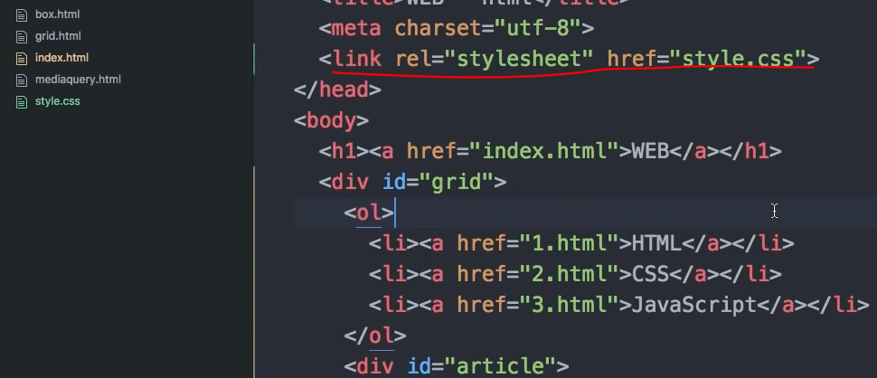

웹을 만든 사람들은 웹페이지를 아름답게 만드는 방법에 대한 깊은 고민에 빠지게 됩니다.


html에서의 주석 작성방법

```<!--   -->```

html에서 css호환을 하기 위해서는 

<style> 이라는 태그를 달아야 합니다.
    이는 html의 태그이지만 CSS의 문법을 해석하는 것이라는 것을 말해줍니다.
</style>

모든 a태그의 색을 빨강으로 바꿔라.

<style>
    a {
        color : red; # 컬러바꾸기
        text-decoration: none; # 웹페이지에 있는 모든 a태그에 대해서 밑줄이 없어진다.
    }
</style>

a를 보고 선택자 라고 부르며

중괄호 안에 들어가있는 것을 보고 효과 Declaration(선언) 이라고 부른다고 합니다.

효과 중 color에 해당하는 부분을 속성이라고 부릅니다.


```<li> <a href = 'www.naver.com' style = 'color:red'> test </a></li>```

style은  html 문법이며 css의 문법에 따른다.


결국 style 태그를 쓴다. style 속성을 쓴다. 두가지 방법만 존재한다.


폰트를 크기 조정하는 속성은 다음과 같습니다.

스타일 태그 안에

​	font-size:45px;

이렇게 지정합니다.


선택자의 대해서 생각해보기

항상 태그만 선택자로 사용할 수 있냐. 아니다.

각각 원하는 부분에 대해서 그룹핑을 할 수 있게끔 하는데, 이는 클래스로 지정한다.

그리고 해당 클래스를 style 태그 안에 넣고 지정한다면 해결이 가능하다.

 


이건 불가능하다.

saw안에 .을 꼭 붙혀줘야한다. 

.은 전체를 뜻하며 전체 saw에 대해서 적용하라고 있는 것입니다.

 

 

가령, class="saw active" 이렇게 두어서

두 가지의 클래스에 영향을 받도록 한다면 가까이에 있는 명령이 더 큰 영향을 받는 것을 볼 수 있습니다.

이는 혼동을 주기 때문에 좋은 문법이 아닙니다.


그래서 나온게 id 입니다.

id 태그를 사용하여 class='saw' id ='active' 라고한다면

#active를 통해서 해당 id로 접근할 수 있게되고 이의 효과을 적용받게 됩니다.


강한 순서 : id 선택자 > 클래스 선택자 > 태그 선택자

이 원리는 어느 것이 더 구체적인가를 기준으로 삼았습니다. 


또한 id 값은 전체에서 한번만 등장해야합니다.

1번 페이지에서 id ="active"를 사용했다면 

2번 페이지에서는 다른 id 값을 사용해야 합니다.

id 선택자를 통해서 예외를 두는 것.


박스모델 : 해당 태그의 부피를 결정하는 요소들 ( 디자인에서 중요함 )

block level element

화면 전체를 쓰는 태그를 상징


inline level element

자기 자신의 컨텐츠만의 크기를 갖는 태그를 상징 


이를 테스트 하기 위해서는 각각 테두리를그려보면 됨

테두리를 그리는 명령어는 border-width, border-color, border-style 등... 이 존재

만약에 block level element라고 한다면 display:inline 을 통해서 inline 태그의 크기만큼만

가질 수 있음

만약에 inline level element라고 한다면 display:block 을 통해서 inline 태그의 크기만큼만

가질 수 있음


 

이런식으로도 중복된 부분을 표현이 가능함

 

아래처럼도 가능해짐( 순서는 중요하지 않음 )


테두리를 선정하면 테두리와 테두리 사이의 간격을 설정하고 싶고 -> margin

테두리와 문자 사이의 간격을 설정하고 싶음 -> padding

으로 설정가능함

 

 

또한 인라인, 블락 단위의 크기가 아니라 해당 크기를 지정하고 싶다면

width를 지정함으로써 가능해짐

 


  

검사를 통해서 마진 값과 패딩 값을 조정한다.

각각의 태그를 검사하면서 조정한다. 반드시 검사를 통해서 해보기. 해보면 박스모델의 꾸미기에 대해 도움이 많이 됨


정보의 배치 관련된 문제

왼쪽 오른쪽에 각각 배치하는 문제

grid 방법 !


정보를 나누고 싶을 때 ( 나란히 표시하고 싶을 때 ) -> h1태그는 제목을 뜻하므로.. 제외


무색 무취의 css를 더 잘 사용하기 위한 태그 -> div 태그 (block level)

무색 무취의 css를 더 잘 사용하기 위한 태그 -> span 태그 (inline level)

두 가지의 태그 중 하나를 사용할 예정

( 아무런 의미 없고 디자인적인 의미만 존재 )

그 이후

div 태그를 감싸는 부모태그를 만듬

그 다음 id 값을 기입 -> id 값으로 css를 꾸밈

display :grid

grid-template-columns: 150px 1fr;

// 첫번째 단어는 150의 크기를 가지고 두번째 단어는 나머지 공간 전체를 가진다. 라는 뜻


  

fr은 프레임이며 전체를 뜻함 따라서 1fr 1fr 이라고 한다면 1:1로 배치됨

caniuse 사이트에다가 문법을 기입하고 사용해도 되는지 확인


부모 태그 내부의 태그 선택자를 css로 스타일을 지정하는 경우

```부모 id ol{```

```	}```  

이렇게 표현합니다.

 


반응형 디자인 : 화면의 크기에 따라서 웹페이지의 요소가 달라짐

mediaquery : 


개발자 도구 오른쪽 상단에 크기가 나옴

```screen width > 800 px ```

@media (min-width:800){ # 폭이 800보다 더 크다면 표현됨  max-width:800 이라고 한다면 화면이 커질때 표현이 안되고 작을때만 표현가능

​	div{

​			display : none;		

​			}

}

 


각각의 웹페이지에 전부 같은 형식으로 꾸미기를 하게 된다면??...

중복되는 형상이 많아지게 될 것이고 이는 코드가 예뻐지지 않는 경우가 발생하게 됩니다.

해당 스타일만 기입해놓은 css 파일을 따로 만들고, <link> 태그를 통해서 해당 css 파일을 적용시켜 줄 수 있습니다.

 

style.css는 해당 style 태그에 담겨있는 모든 정보를 기입해놓음

