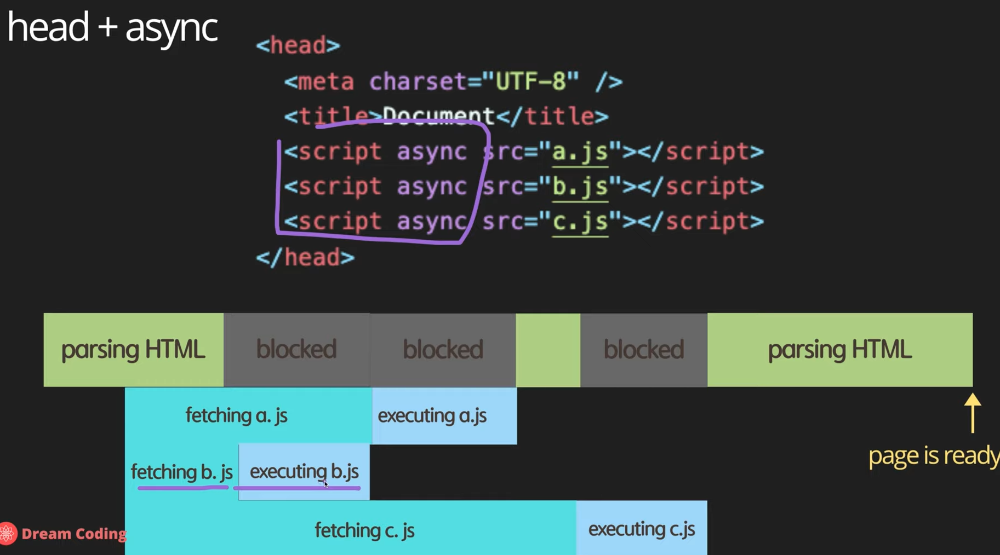
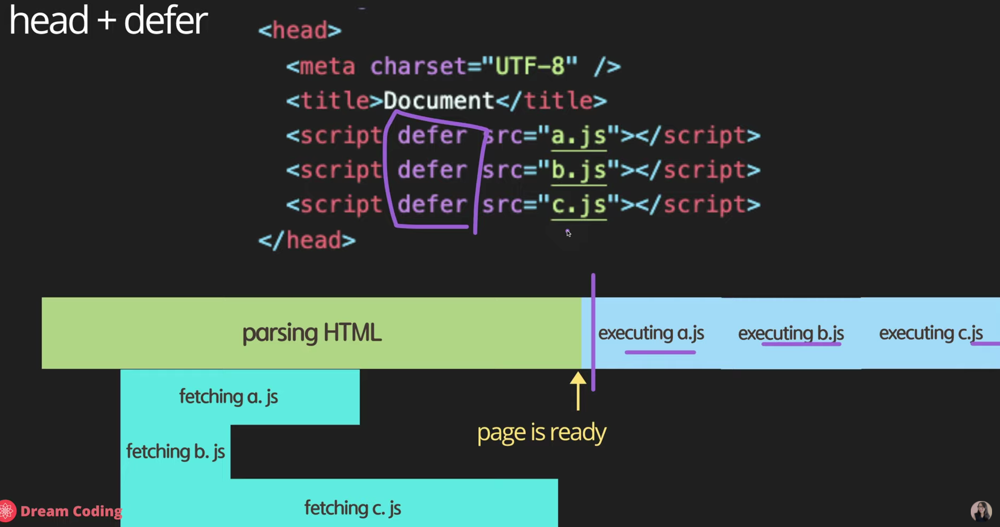
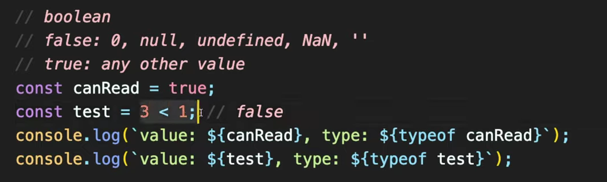
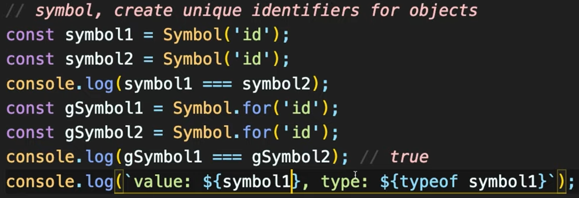

자바스크립트

자바스크립트는 HTML 위에서 작동함

이 두가지를 어떻게 상호작용 시킬 것인가..

자바스크립트를 넣는 방법 

스크립트 태그로 인해 자바스크립트 코드를 사용한다는 것을 알 수 있음

버튼 추가

<input type = "button" value = "hi" onclick = "alert('hi')">

onclick : 자바스크립트 언어가 와야하고 눌렀을 때 실행됨

<input type = "text" onchange="alert('changed')">

onchange : 글자가 바뀌었을 때 실행됨

onkeydown : 키가 눌려졌을 때 실행됨\

10개 ~ 20개 정도 되는 이벤트가 존재함

이 것들 통해서 버튼 및 입력을 표현 가능함

콘솔을 활용하여 자바스크립트를 사용하는 방법

 

웹페이지 자체에서 콘솔을 이용하여 자바스크립트 코드를 사용할  수 있음.

자바스크립트 자료형 

- Boolean
- Null
- Undefined
- Number
- String
- Symbol

Object

 

셀렉터로 원하는 셀렉터를 지정하고, 스타일 중 원하는 부분에 색을 넣습니다.

---------------

드림코딩 - 강의

main.js는 node.js 파일임

console.log('Hello world') # 우리가 원하는 메시지를 콘솔 창에 출력한다.

웹 API : 브라우저가 이해할 수 있는 함수들임 (자바 스크립트의 기능이 아님)

개발툴 잘 활용하기.

콘솔 : 인터프리터 형식으로 실행가능함

소스 : 우리가 페이지를 작업할 때 사용한 소스코드가 나옴

네트워크 : 얼마나 많은 데이터가 오고 가는지를 확인할 수 있음

공식사이트 : ecma 사이트

편하게 볼 수 있는 사이트 : mozilla 사이트 (추천)

async vs defer # 자바스크립트를 html에 포함시킬때 어떤 방식이 더 효율적인가..

head에 해당 script 의 소스를 넣어도 되고, body에 넣어도 되지만,

페이지를 불러오다가 상위 포지션의 활동을 만나게 되었을 때 페이지를 block 시키고 

상위 포지션의 활동을 진행하게 됩니다.

따라서 페이지를 불러오는데 너무 많은 시간이 걸립니다.

반면에 body에 해당 script 파일을 넣는다면, 페이지를 다 불러오고 마지막에 스크립트 파일을 불러오게 됩니다.

하지만 html의 컨텐츠는 빨리 보지만 웹사이트가 자바스크립트에 의존적인 경우 효율적이지 않습니다.

다음 방법은 asyn를 사용하는 방법입니다. head 내부에 해당 소스코드를 적습니다.

 

병렬적으로 해당 js파일을 패칭하게끔 만듭니다. 패칭이 다된 이후 HTML 파싱을 block하고 js파일을 실행합니다.

하지만 실행되는 터미널이 하나이기 때문에, 패칭 이후 실행될때 HTML은 block 상태가 됩니다. 비교적 빠릅니다.

다음 방법은 defer 입니다. 사용방법은 head 내부에 해당 소스코드를 적습니다.

 

defer의 경우 병렬적으로 받아 js파일을 패칭하게 됩니다. 이후 HTML이 다 파싱이 완료된 상태일 때

패칭한 js파일을 실행시킵니다. 제일 효율적인 방법입니다.

여기서 고민해야할 부분은 여러가지의 script를 받을 때 입니다. 

 

그 중 script 파일 내부에서도 우선순위가 있는 파일들이 존재할 텐데 우선순위의 파일이 패칭될 때까지 다음 파일을 실행하지 못하는 문제점이 있습니다.

 

 

defer 옵션은 해당 방법에 대한 완벽한 해결책입니다.

그리고 바닐라 자바 스크립트를 사용할 때는 위에 'use strict' 라고 써주는 것이 좋습니다.

성능개선 + 비상식적인 코드의 남발을 제외해줌

자바스크립트 데이터 타입

let (ES6에 추가됨) // 메모리 타입 선언

let name = 'jaehyun'

로컬 스코프를 선언할 때는 함수를 따로 선언하지 않고 {  } 내부에서 선언합니다.

let 이전에는 var라는 키워드를 사용했습니다. 이것은 예전문법이니 삭제

hoisting 이라는 것은 선언 느낌임 언제 코드가 쓰여졌는지 상관없이 탑으로 해당 코드를 옮겨서 실행시켜줍니다.

var 같은 경우 hoisting이 가능해서 코드 해석이 어려워지며, 또한 로컬 스코프의 사용이 불가능하다. (항상 block 스코프 )

상수 : Contants

가르키고 있는 포인터를 잠궈놓음 상수로 선언하면 됨

const daysInWeek = 7;

number 이라고 선언해도 되지만, let으로만 선언해도 자동으로 타입이 바뀌어서 선언됨

자바 스크립트는 기존에 없어보이는 여러가지의 리턴 타입이 존재

1. infinity ( 1 / 0 )
2. -infinity ( -1 / 0 )
3. nAn ( 'not a number' / 2)

bigint 타입 : 숫자 + n

이지만 호환되는 웹사이트가 많지 않으니 나중에 더 잘 쓰이면 확인해야함

template literals (sting 타입)

console.log('value:${name}') # f string과 비슷한 문법

 

 

True와 false의 차이

null로 값을 할당가능

선언만 하고 값이 할당되지 않은 경우 undefined 라고 표현됨

이 것을 직접 let x = undefined 라고 표현해도 됨

Symbol : 객체에 대한 유일한 확인자이다.

따라서 아래와 같이 선언해도 두 가지는 다른 것이다.

만약에 Symbol.for('id') 라고 선언한담녀 해당 id가 같을 경우 같다고 표현된다.

 

심볼은 value 값을 바로 확인 할 수 없고(오류), 항상 .description을 통해서(문자열을 만들어서) 표현해야 합니다. 

Dynamic typing : 프로그램이 동작할 때 (런타임) 자동으로 타입이 변경됨

이는 연산에서 큰 문제임 

문자열 + 숫자 : 합쳐진 숫자로 인식됨 ex) "4" + 6  = 46이고 type : number

문자열 / 문자열 : 숫자로 인식됨

리스트처럼 개별 원소에 지정할 경우는 text.charAt(0) 으로 개별 리스트에 접근할 수 있음

문자열을 예시로 든다고 한다면 hello 에서는 h가 출력됨

자바스크립트는 타입변경이 런타임에서 실행되기 때문에 이에 따른 오류가 발생할 수 있음

이를 해결하기 위해서 Type Script가 나오게 됨

우선 자바스크립트를 배우고 나중에 Type Script에 관련된 내용을 배우게 될 경우 더 쉽게 배워짐

앞으로 바뀌지 않을 값에 대해서는 전부 Constant로 저장

연산은 기본적인 연산과 동일하지만

++ 연산이나 -- 연산의 경우 약간 다름

const preDecrement = --counter;

이런식으로 선언됨 ( ++도 마찬가지 )

+= -= 등 또한 가능합니다.

or 연산자 ||를 통해 활용 and 연산자 &&를 사용, not은 !를 통해서 활용함

중요)  심플한 애들을 먼저 호출하는 효율적인 코드 작성

== : 타입을 변경해서 검사 ex) 문자열 "2" 와 숫자 2가 같다고 나옴

=== : 타입이 다르게 된다면 다른 값 ex) 문자열 "2"와 숫자 2가 다르다고 나옴

보통 언어에서 쓰이는 ==연산은 타입까지 확인하므로 자바스크립트에서는 ===을 활용하는 것이 좋음

 const ellie1 = { name : 'ellie' }

 const ellie2 = { name : 'ellie' }

 const ellie3 = ellie1

console.log( ellie1 == ellie2 ) # 같은 곳을 찾조하지 않기 때문에 F  얕은 복사, 깊은 복사

console.log( ellie1 === ellie2 ) # 같은 곳을 참조하지 않기 때문에 F 얕은 복사, 깊은 복사

console.log( ellie1 == ellie3 ) # 같은 곳을 참조하고 있기 때문에 T 얕은 복사, 깊은 복사

console.log( 0 == false ); # 값이 똑같기 때문에 True

console.log( 0 === false ); # 값이 똑같지만 타입이 Boolean 타입이기 때문에 False

console.log( '' == false ); # 값이 동일하기 때문에 True

console.log( '' === false ); # 값이 동일하지만 Boolean 타입이기 때문에 False

console.log(null == undefined ); null과 undefined는 같은 값으로 인식 되어서 True

console.log(null === undefined ); 같은 값이지만, 타입이 각자 다르기 때문에 False

if (name === 'ellie') {	

​	console.log('')

} else if  ( name == 'coder' ){

​	console.log('') 

}else{

​	console.log('')

}

Ternary operation : 	# 간단한 if문을 표현할 경우 사용됨

condition ? value1 : value2

console.log( name === 'ellie' ? 'yes' : 'no' )  # 간단할 때만 사용됨

switch (browser) {

​	case 'IE':

​		console.log('go away!');

​		break;

​	case 'Chrome':

​		console.log('love you!');

​		break;

​	default:

​		console.log('same all!')

​		break;

}

While문 

while ( i > 0 ) {

​	console.log('while');

​	i ++;

}

do While 문 # 우선 do를 실행시키고 그다음에 조건문 검사

do {

​	console.log('while');

​	i ++;

}while ( i > 0 )

for ( i = 3; i > 0; i -- ) {

​	console.log(' for 문 ');

}

for ( let i = 2; i > 0; i  = i - 2){

 // 안에서 바로 선언도 가능

​	console.log('inline variable for 문')

}

for문 중첩까지 가능 

break는 루프를 끝냄

continue는 해당 부분은 다음 콘솔로 시작함

Functions

JS에서는 함수에서 카멜케이스로 작성됨

하나의 함수는 하나의 기능을 지정함 만약 지정하기 어렵다면 기능을 제대로 안한거임

function printHello() {

​	console.log( 'Hello');

}

printHello()

function log(message){ # 매개변수 사용가능

​	console.log(message)

}

function showMessage (message, from = 'unknown'){ # 만약 인자가 하나만 들어오는 경우 default 값이 출력

​	console.log(message);

​	console.log(from);

}

Rest Parameters : 입력되는 형태가 배열형태 이라고 한다면

function printAll( ...args ){

​	for (let i = 0; i < args.length; i ++ ){ # args.length는 해당 배열의 길이를 리턴해줌

​		console.log(args[i])

​	}

}

for ( const arg of args ){ # 입력되는 형태가 배열형태이면서 해당 값을 바로 출력하고 싶을 때

​	console.log(arg);

}

더 쉬운 구현도 존재..

args.forEach( (arg) => console.log(arg) )

이렇게 해도 되긴함 이는 나중에 자세하게 다룰 예정

스코프 개념에 대해서 알아볼 예정이지만

한가지만 이해하고 있으면 됨 -> 최신 유리창

밖에서는 안이 보이지 않고, 안에서만 밖을 볼 수 있다.

함수 작성 팁 : 조건에 해당되지 않는 경우 해당 함수를 빠르게 종료시키는 코드가 위쪽에 와야한다.

Function expression

함수를 작성하자 말자 상수에 할당하는 경우이며 이는 함수의 이름이 있는 경우와 없는 경우로 나눠진다.

anonymous function에 대한 예시

const print = function {

​	console.log('print');

} ;

print();

const printAgain = print; # 이렇게 계속 사용가능

named function에 대한 예시 # 디버깅 할때 호출 스택으로 해당 함수의 이름이 나오게 됨 (편리함)

const print = function.print {

​	console.log('print');

} ;

print();

왜 이를 사용하는가. hoisting 기능 때문에 사용됨

해당 함수를 선언하기 전에 이를 호출하면 해당 ref로 이동하면서 바로 사용가능

callback function : 함수 내부에서 다른 함수를 호출할 때 ( globla scope )

const printYes = function (){

​	console.log('yes')

}

const printNo = function (){

​	console.log('No')

}

ex )

function randomQuiz(answer, printYes, printNo ){

​	if ( answer == 'love you' ){

​		printYes();

​	} else {

​		printNo();

​	}

}

Arrow function  : 함수를 간결하게 표현할 수 있는 굉장히 편한 기능 (항상 unnonymous function임 )

const simplePrint = () => console.log( 'simplePrint' )

const add = ( a, b ) => a + b;  # 이렇게 쉽게 표현가능함

IIFE : Immediately Invoked Function Expression

사용방법 : 전체를 ( ) 로 묶고 마지막에 ( )를 더 붙혀줘서 호출한다.

기능 : 함수를 선언하고 바로 결과를 보고 싶을 때 사용한다. 

(function hello( ){

​	console.log('IIFE')

})();

JS에서의 클래스

class Person {

​	constructor(name, age) {

​		// fields

​		this.name = name

​		this.age = age

​	}

​	// method

​	speak(){

​		console.log('hello')

​	}

}

const man = new Person('jaehyun', 20) // 새롭게 인스턴스를 선언할 때는 new 라는 것을 붙힘

getter, setter에 대한 예제

class User {

​	construction(firstName, lastName, age) {

​		this.firstName = firstName

​		this.lastName = lastName

​		this.age = age

​	}

​	get age( ) { # age가  호출될 때 자동호출

​		return this._age

​	}

​	set age(value){ # age가 할당될 때 자동호출

​		this._age = value < 0 ? 0 :  value;

​	}

}

이렇게 선언해놓으면 age가 잘못된 값이 들어왔을 때 바로 수정이 가능하다.

또한 내부적으로 이러한 할당과정은 set과 get 함수로 이루어져 있다는 것을 알 수 있고,

클래스 내부에서 새롭게 set과 get 함수를 정의할 수 있다는 것을 알 수 있다 .

_의 의미는 private하다는 의미가 아니라, 같은 값으로 호출을 받는 경우 계속해서 할당이 계속 진행되기 때문에

_를 붙혀서 이를 해결하고자 하는 약속이다.

만약에 set age(value){

​		this._age = value < 0 ? 0 : value

​	}

throw Error( '문구 '); 를 호출하면 Error를 호출해준다.

클래스 변수에 대한 접근이 허용이 가능해졌고 이를 static이라는 연산자를 통해서 호출할 수 있음

클래스 변수에 대한 접근은 static으로만 선언이 가능하고, 이는 static으로만 호출이 가능함

호출되는 형태는 인스턴스.메서드 형식이 아닌, 클래스.메서드 형식으로 호출이 가능함

class Article {

​	static publisher = 'Dream Coding';

​	constructor(articleNumber){

​		this.articleNumber = articleNumber;

​	}

​	static printPublisher( ){

​		console.log(Article.publisher );

​	}

}

상속

class Shape{

​	pass...

}

class Rectangle extends Shape { } // 이렇게 호출만 한다면 상속완료

부모 클래스의 기능을 전부 사용가능함

다형성 : 필요한 메서드만 재작성가능함 ( 오버라이딩 )

​	자식 클래스에서 따로 메서드를 재정의 하는 경우 해당 함수가 호출됨

​	만약 부모 클래스의 함수까지 호출하고 싶다면 super.함수명()을 호출하여 해결이 가능합니다.

instanceof 라는 것을 사용하여 해당 클래스와 인스턴스인지 아닌지 확인해줌

주의할 점 : 모든 인스턴스는 Object를 상속 받고 있어서 해당 인스턴스라고 표현이 가능합니다.

또한 부모클래스와 비교할 때는 상속이 되었던 클래스의 인스턴스로 들어가게 되어서 True가 나오게 됩니다.

