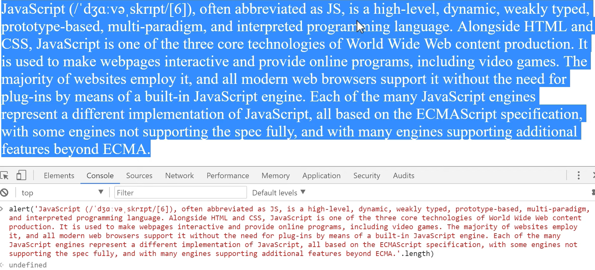
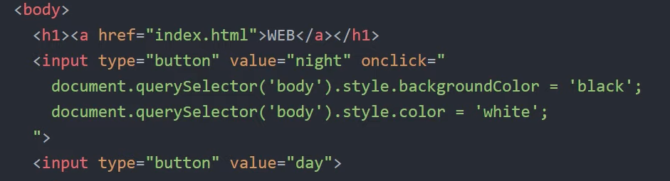

자바스크립트

자바스크립트는 HTML 위에서 작동함

이 두가지를 어떻게 상호작용 시킬 것인가..

자바스크립트를 넣는 방법 

스크립트 태그로 인해 자바스크립트 코드를 사용한다는 것을 알 수 있음

버튼 추가

<input type = "button" value = "hi" onclick = "alert('hi')">

onclick : 자바스크립트 언어가 와야하고 눌렀을 때 실행됨

<input type = "text" onchange="alert('changed')">

onchange : 글자가 바뀌었을 때 실행됨

onkeydown : 키가 눌려졌을 때 실행됨\

10개 ~ 20개 정도 되는 이벤트가 존재함

이 것들 통해서 버튼 및 입력을 표현 가능함

콘솔을 활용하여 자바스크립트를 사용하는 방법

 

웹페이지 자체에서 콘솔을 이용하여 자바스크립트 코드를 사용할  수 있음.

자바스크립트 자료형 

- Boolean
- Null
- Undefined
- Number
- String
- Symbol

Object

 

셀렉터로 원하는 셀렉터를 지정하고, 스타일 중 원하는 부분에 색을 넣습니다.

